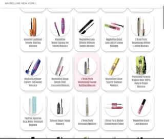

# Maybellin SPA

Single page application creada para consumir una API de productos de maquillaje, con detalles individuales y conexión a páginas externas para conseguir el producto directamente con los distrubuidores principales.

## Tech Stack

**Client:** HTML, CSS y JavaScript vanilla

**Server:** Node, Webpack y Babbel

  
## API Reference

#### Get all items

```http
  GET https://salty-beyond-87863.herokuapp.com/api/v1/products
```

| Parameter | Type     | Description                |
| :-------- | :------- | :------------------------- |
| `API` | `string` | ?offset=${page})&results=100 |

#### Get item

```http
  GET https://salty-beyond-87863.herokuapp.com/api/v1/products/${id}
```

| Parameter | Type     | Description                       |
| :-------- | :------- | :-------------------------------- |
| `id`      | `string` | ${id} |

## Deployment

https://elsargentpepper.github.io/Maybellin_SPA/
  
## Demo


